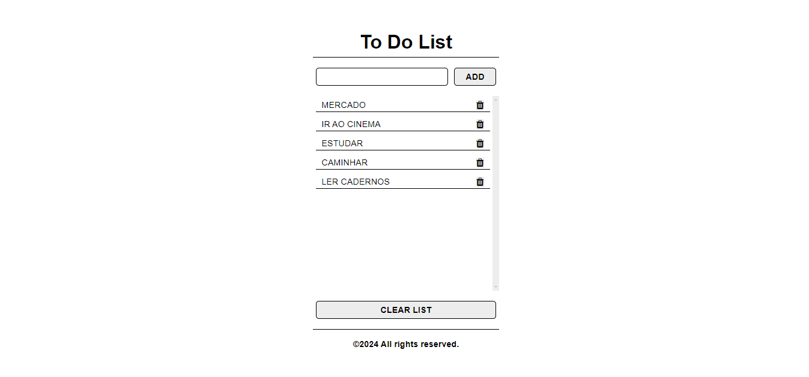
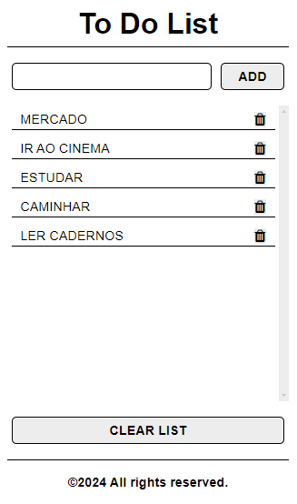

# **To-Do-List**

## Sobre o projeto

Projeto: [Clique e acesse o projeto em Angular](https://angular-to-do-list-rho.vercel.app/)

Trabalho realizado com o framework Angular, com uso de Typescript, HTML5, CSS3 e Flexbox. 

O aplicativo consiste em adicionar tarefas diárias, tendo a opção de removê-las individualmente ou limpar a lista inteira. Usei um array para a demonstração; e ao atualizar a página os dados não persistem.

Trabalhei com componentes de cabeçalho, de rodapé e de conteúdo; dividindo as responsabilidades.

 

Work carried out with the Angular framework, using Typescript, HTML5, CSS3 and Flexbox.

The application consists of adding daily tasks, having the option to remove them individually or clear the entire list. I used an array for the demonstration; and when refreshing the page the data does not persist.

I worked with header, footer and content components; dividing responsibilities.

## Layout Web

## Tecnologias Utilizadas

* HTML5
* CSS3
* Flexbox
* Typescript
* Font Awesome Icons
* Angular

## Instalar

##### Instalar Dependências
<pre><code>npm install</code></pre>

##### Executar Aplicação
<pre><code>ng serve</code></pre>

## Autor

#### **Katarine Albuquerque**

    
    &nbsp;
    

